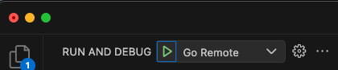
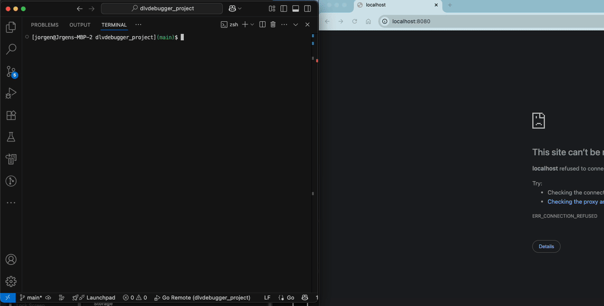

# Go Project Debugging with Air and Docker

This repository provides an example setup for debugging a Go project using `air` for live reloading within a Dockerized environment.

## Getting Started

### Build and Run (with initial build)
To build the Docker images and start the services:
```bash
docker compose up --build
```

### Run (without rebuilding)
To start the services without rebuilding the Docker images (useful for subsequent runs):
```bash
docker compose up
```

## Attaching the debugger
To attach the debugger in vscode you can press "f5" or press the green play button.



## Caveats
When you make changes you have to reattach the debugger (f5)


# Demo

